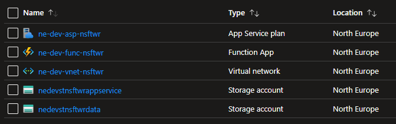
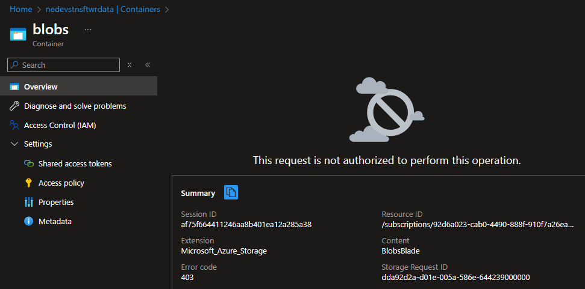
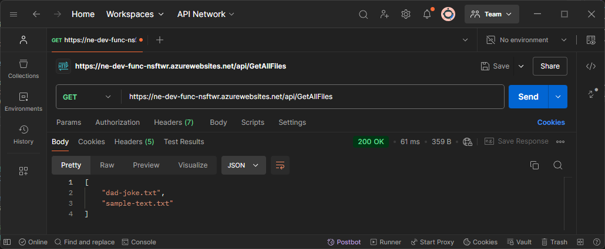
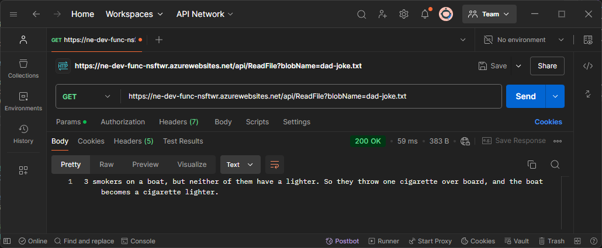

## Introduction

Simple Function App that serves as an API to list and read blobs in a storage account. Storage account is only accesible via the Fuction App, since they're in the same virtual network, and access outside this network is restricted.

## Deployment

Use the following cmd'let to deploy the infrastructure:

`az deployment group create --resource-group <RESOURCE GROUP NAME> --template-file .\iac\main.bicep --parameters params="@.\iac\parameters.json"`

## Demo

- All deployed resources

- Access denied via the portal due to IP not being whitelisted:

- Call the `GetAllFiles` endpoint to list all blobs un the storage container

- Call the `ReadFile` endpoint to read the contents of the blob

